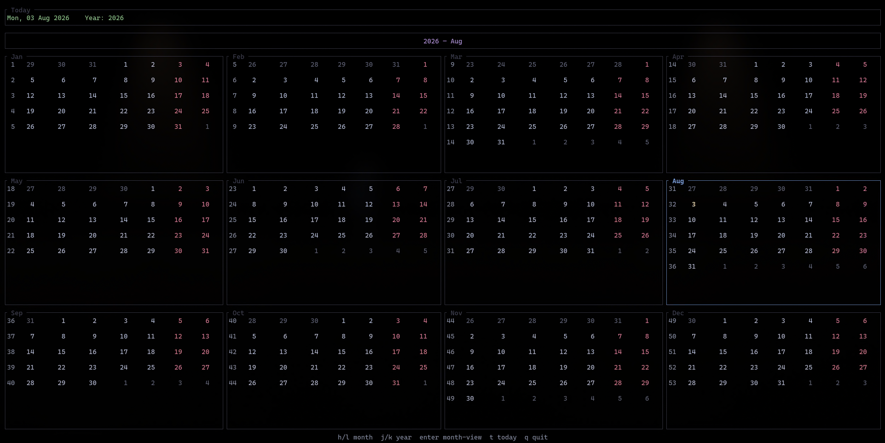

# calendar-tui

A minimal, fast **terminal calendar** built with [ratatui](https://crates.io/crates/ratatui)

## Keybindings

Global:

| Key      | Action                              |
| -------- | ----------------------------------- |
| `q`      | Quit                                |
| `Ctrl+c` | Quit                                |
| `m`      | Month view                          |
| `y`      | Year view                           |
| `Esc`    | Back to year view (from month view) |

**Month view** (navigation):

| Key               | Action                    |
| ----------------- | ------------------------- |
| `Left` / `h`      | Previous month            |
| `Right` / `l`     | Next month                |
| `Up` / `k`        | Previous year             |
| `Down` / `j`      | Next year                 |
| `PgUp` / `PgDn`   | Previous / next month     |
| `Home` / `t`      | Jump view to today        |
| `Enter` / `Space` | Toggle day selection mode |

**Month view** (selection mode, after `Space`):

| Key                                         | Action               |
| ------------------------------------------- | -------------------- |
| `Left` / `Right` / `h` / `l`                | Previous / next day  |
| `Up` / `Down` / `k` / `j` / `PgUp` / `PgDn` | Previous / next week |
| `Space` / `Enter`                           | Exit selection mode  |
| `Home` / `t`                                | Jump to today        |

**Year view**:

| Key             | Action                          |
| --------------- | ------------------------------- |
| `Left` / `h`    | Focus previous month            |
| `Right` / `l`   | Focus next month                |
| `Up` / `k`      | Previous year                   |
| `Down` / `j`    | Next year                       |
| `PgUp` / `PgDn` | Previous / next year            |
| `Home` / `t`    | Jump to today                   |
| `Enter`         | Open focused month (month view) |

A help line at the bottom of the screen summarizes bindings for the current mode.

## Configuration

### Paths

| File   | Default location                                                                                 |
| ------ | ------------------------------------------------------------------------------------------------ |
| Config | `$XDG_CONFIG_HOME/calendar-tui/config.toml` (falls back to `~/.config/calendar-tui/config.toml`) |
| Theme  | Resolved from `[calendar].theme` in config (see below)                                           |
